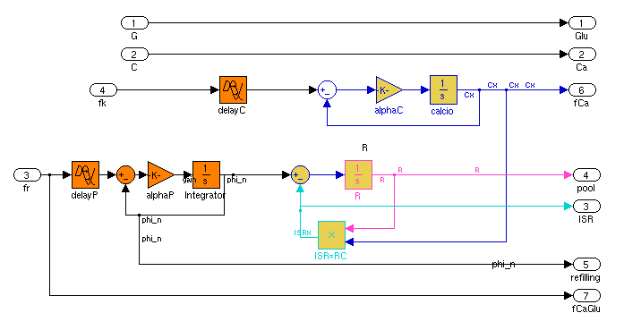
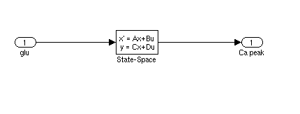

# Beta Cell Model, Grespan-Mari, 2017

This repository contains the code implementing Grespan-Mari's
model of glucose-calcium-mediated insulin release in the Beta cell.

The model is implemented in Matlab and Simulink (both are required).
The file `betacell_model_sim.m` reproduces the main figures of the
article. The output of the file (including figures) is available
in the [betacell_model_sim.html](html/betacell_model_sim.html) report.

The rest of this file documents the data sources and parameters
used by the model, plus the correspondences between the code variables
and the symbols used in the paper.

## Main functions

Matlab file | Function in the article
------------|----------------
`fCa.m` | *fk* in the article
`fCaGlu.m` | *fr* in the article
`casim.m` | calculates *C(t)* when it is not experimentally available
`glu2ca.m` |  *Cs(t)* in the article
'secsim.m' |  calculates *S(t)*, *Q(t)* and *r(t)* in the article

## Simulink models

* `betavars.mdl` Simulink file that describes the
  glucose-calcium-insulin model. The inputs of the model are calcium
  and glucose after being transformed by the sigmoidal functions `fCa.m`
  and `fCaGlu.m`, respectively. The main output is the insulin secretion
  rate (ISR).

  

* `capeakmode.mdl`: Simulink file that calculates the dynamic
  component of the calcium signal when it is not experimentally
  available:
  
  
  

## Dataset and parameters

The parameters are the result of the fit to the experimental data (see below for the list of  publications). Each dataset (related to a specific experimental condition) and the corresponding reference parameter vector (p) are saved in a different file .mat (see below). 

### In vitro tests

Data source:

1.  Simulation of glucose and calcium decoupling. Fig. 4 [J-C Henquin et al., Diabetes, 2002](https://doi.org/10.2337/diabetes.51.2007.S60).
2.  Glucose clamp. Fig. 3 [J-C Henquin et al., Diabetes, 2006](https://doi.org/10.2337/diabetes.55.02.06.db05-1051).
3. Stepped hyperglcaemic clamp. Fig. 7 [J.C. Jonkers et al., Diabetes, 2001](https://doi.org/10.2337/diabetes.50.3.540).

### In vivo tests

Data source:

1. Stepped hyperglycemic clamp: [Toschi et al., 2002](https://doi.org/10.2337/diabetes.51.2007.S130)
2. OGTT-like: Fig. 3 [Muscelli E. et al, Am. J. Physiol. Endocrinol. Metab., 2006](https://doi.org/10.1152/ajpendo.00571.2005)
3. IVGTT: Fig 3 [Mari A., Diabetologia, 1998](https://doi.org/10.1007/s001250051027)
4. Glucose ramp: [Seghieri et al., Am. J. Physiol. Endocrinol. Metab., 2016](https://doi.org/10.1152/ajpendo.00428.2015)
5. Hyperglycemic clamp: [Mychaliszin et al., Diabetes, 2014](https://doi.org/10.2337/db13-1951)

### Parameters

The parameters are the result of the fit to the experimental data (see abofor the list of publications). Combinations of experiments and conditions are in columns, and model parameters in rows, as follows.
Each column of the matrix par_all.mat corresponds to the set of parameters used for the 12 tests. Some parameters were enforced to be equal across experiments and/or conditions during the fitting (see paper).

#### Parameters of the experiments in vitro:

* `Henquin_2002.mat`: glucose and calcium decoupling
* `Henquin_2006.mat`: hyperglycemic clamp
* `Jonkers_2001.mat`: stepped hyperglycemic clamp

#### Parameters of the experiments in vivo - normal glucose tolerant subjects:

* `Toschi_2002_NGT.mat`: stepped hyperglycemic clamp
* `Mari_1998_NGT.mat`: IVGTT
* `Muscelli_2006_NGT.mat`: OGTT
* `Seghieri_2016_NGT.mat`: glucose ramp
* `Mychaliszin_2014_T2D.mat`: hyperglycemic clamp

#### Parameters of the experiments in vivo - type 2 diabetes subjects:

* `Mari_1998_T2D.mat`: IVGTT
* `Muscelli_2006_T2D.mat`: OGTT
* `Seghieri_2016_T2D.mat`: glucose ramp
* `Mychaliszin_2014_T2D.mat`: hyperglycemic clamp

Each element of the parameter vector (p) corresponds to a parameter in the equations of the paper:

Column | Parameter in the article
-------|-------------------------
p(1) |  p6 in the article
p(2) |  p7 in the article
p(3) |  p8 in the article
p(4) |  p9 in the article
p(5) |  p10 in the article
p(6) |  p11 in the article
p(7) |  Parameter not used
p(8) |  p5 in the article
p(9) |  p1 in the article
p(10) |  p2 in the article
p(11) |  p3 in the article
p(12) |  p4 in the article
p(13) |  p15 in the article
p(14) |  p14 in the article
p(15) |  p12 in the article
p(16) |  p13 in the article
p(17) |  p21 in the article
p(18) |  p22 in the article
p(19) |  p23 in the article
p(20) |  p24 in the article
p(21) |  p16 in the article
p(22) |  p17 in the article
p(23) |  p18 in the article

The parameters *p19* and *p20* of the article are the first and second
elements of the vector `p_peak` in the file `betacell_model_sim.m`.

 

