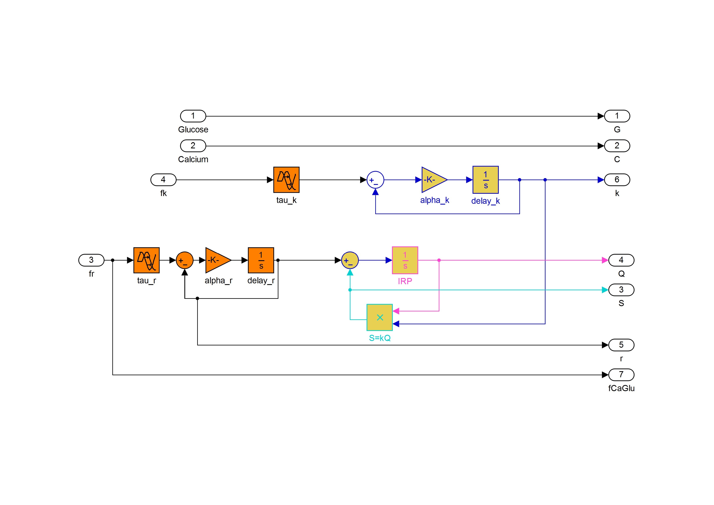

# Beta Cell Model, Grespan-Mari, 2017

This repository contains the code implementing Grespan-Mari's
model of the beta cell.

The model is coded in Matlab and Simulink (both are required).
The Matlab script `betacell_model_sim.m` reproduces the main figures of
the article. The script produces the html file [betacell_model_sim.html](html/betacell_model_sim.html) with the Matlab Publish function.

This readme file shortly describes the Matlab functions and the Simulink model files and summarizes the data used in the simulations.

The script has been tested with Matlab 2010b.

## Matlab functions

Matlab file | Description
------------|------------
`fCa.m` | Implements *fk* of the article
`fCaGlu.m` | Implements *fr* of the article
`glu2ca.m` | Implements *Cs(G)* of the article
`casim.m` | Calculates *C(t)* when it is not experimentally available
`secsim.m` | Calculates *S(t)*, *Q(t)* and *r(t)* in the article
`betasim.m` | Core wrapper for the main Simulink model betavars.mdl
`loadpar.m` | Loads the model parameter for a specific experiment
`setAxes.m` | Auxiliary function to format figure axes
`saveas_ifsvg.m` | Auxiliary function to save plots is svg format

## Simulink models

Simulink file | Description | Figure
--------------|-------------|-------
`betavars.mdl` | Main glucose-calcium-insulin secretion model | 1
`capeakmod.mdl` | Simulator of the dynamic component of the calcium model | 2

**Remarks:**

* The functions `fCa.m` and `fCaGlu.m` complement the Simulink model `betavars.mdl`, representing fk and fr.

* The Simulink model `betavars.mdl` provides insulin secretion, the IRP and refilling (*S(t)*, *Q(t)* and *r(t)* in the article).

* The full calcium model is implemented in `casim.m`, where the static component Cs(G) (function `glu2ca.m`) is used.

## Dataset and parameters

The data (glucose concentration, calcium concentration and insulin secretion) are stored in mat files named as shown in the tables below. The data file also stores the model parameters (as a vector p) appropriate for the data.

### In vitro tests

Data file | Description | Reference
----------|-------------|----------
`Henquin_2002.mat` | Glucose and calcium decoupling | 1
`Henquin_2006.mat` | Hyperglycemic clamp | 2
`Jonkers_2001.mat` | Stepped hyperglycemic clamp | 3

**References**:

1. [J-C Henquin et al., Diabetes, 2002](https://doi.org/10.2337/diabetes.51.2007.S60).
2. [J-C Henquin et al., Diabetes, 2006](https://doi.org/10.2337/diabetes.55.02.06.db05-1051).
3. [J.C. Jonkers et al., Diabetes, 2001](https://doi.org/10.2337/diabetes.50.3.540).

### In vivo tests

Data file | Description | Reference
----------|-------------|----------
`Toschi_2002.mat` | Stepped hyperglycemic clamp | 1
`Mari_1998.mat` | IVGTT | 2
`Muscelli_2006.mat` | OGTT-like test | 3,4
`Seghieri_2016.mat` | Glucose ramp | 5
`Mychaliszin_2014.mat` | Hyperglycemic clamp | 6

**Remark:** The data file name has the suffix `_NGT` for the subjects with normal glucose tolerance and `_T2D` for type 2 diabetic subjects.

**References**:

1. [Toschi et al., 2002](https://doi.org/10.2337/diabetes.51.2007.S130)
2. [Mari A., Diabetologia, 1998](https://doi.org/10.1007/s001250051027)
3. [Muscelli E. et al, Am. J. Physiol. Endocrinol. Metab., 2006](https://doi.org/10.1152/ajpendo.00571.2005)
4. [Muscelli E. et al, Diabetes, 2008](https://doi.org/10.2337/db07-1315)
5. [Seghieri et al., Am. J. Physiol. Endocrinol. Metab., 2016](https://doi.org/10.1152/ajpendo.00428.2015)
6. [Mychaliszin et al., Diabetes, 2014](https://doi.org/10.2337/db13-1951)

